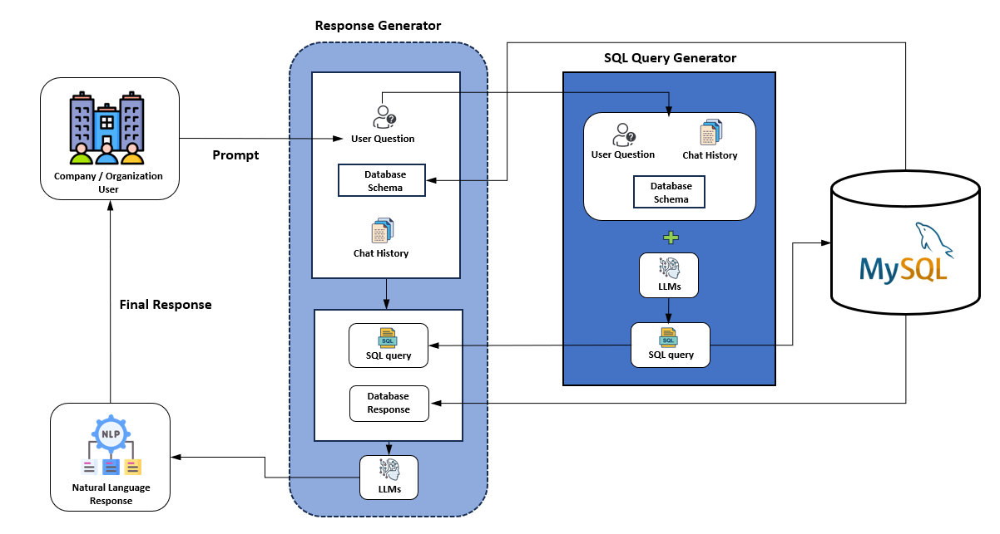

<div align="center">
  <h3>
    MySQL-RAG: LLM-Powered SQL Chatbot
  </h3>
</div>

<div align="center">


[](https://github.com/YUGESHKARAN/MySQL-RAG/blob/main/LICENSE)
[](https://www.python.org/)
[](https://github.com/YUGESHKARAN/MySQL-RAG/commits/main)
[](https://github.com/YUGESHKARAN/MySQL-RAG/issues)
[](https://github.com/YUGESHKARAN/MySQL-RAG/pulls)
[](https://github.com/YUGESHKARAN/MySQL-RAG/stargazers)
[](https://github.com/YUGESHKARAN/MySQL-RAG/network/members)
</div>


**MySQL-RAG** is an advanced SQL chatbot application that combines the power of Retrieval-Augmented Generation (RAG) and Large Language Models (LLMs) to enable natural language interaction with MySQL databases. Built with a Python Flask backend and utilizing the meta-llama/Llama-4-Scout-17B-16E-Instruct model, this chatbot allows users to analyze, visualize, and manage database records using conversational queries—eliminating the need to write SQL manually.

<p
  align="center">
   
</p>

## Key Features

- **LLM-Powered Chatbot:**  
  - Uses the `meta-llama/Llama-4-Scout-17B-16E-Instruct` model for advanced SQL reasoning.  
  - Converts natural language queries into SQL commands for data retrieval, analysis, and modification.

- **Flask Backend:**  
  - Lightweight and easy-to-deploy Python backend for API and chatbot logic.

-  **RAG Architecture:**  
  - Integrates retrieval mechanisms with generative AI for precise and context-aware responses.

- **Database Operations:**  
  - Supports `SELECT`, `UPDATE`, `DELETE`, and other SQL operations through chat.

-  **Easy Deployment:**  
  - Ready for platforms like Vercel (see `vercel.json` for config).

---

## Folder Structure

- **.gitignore** – Git ignore rules
- **app.py** – Main Flask application and API endpoints
- **requirements.txt** – Python dependencies
- **test.py** – Test scripts for chatbot/database functionality
- **vercel.json** – Deployment configuration for Vercel

## Getting Started

### 1. Clone the Repository

```bash
git clone https://github.com/YUGESHKARAN/MySQL-RAG.git
cd MySQL-RAG
```

### 2. Install Dependencies

It is recommended to use a Python virtual environment:

```bash
python -m venv venv
source venv/bin/activate  # On Windows: venv\Scripts\activate
pip install -r requirements.txt
```

### 3. Configure Environment

- Set up your MySQL database and update the connection parameters in `app.py`.
- Configure access to the meta-llama/Llama-4-Scout-17B-16E-Instruct model as required (API key or local model path).

### 4. Run the Application

```bash
python app.py
```

The Flask application should now be running (default: `http://127.0.0.1:5000/`). You can interact with the chatbot via the provided API endpoints or connect with your frontend.

### 5. Testing

To run test scripts:

```bash
python test.py
```

## Example Usage

- **Natural Language Query:**  
   - "Show me all students with attendance below 75% in March."
- **Chatbot Output:**  
   - Returns a table/list based on your database records.
   -  Confirms update and shows the modified record.

- **Database Modification:**  
   - "Update attendance for John Doe to 85% in Mathematics."
 

## Model Details

- **LLM Used:** [meta-llama/Llama-4-Scout-17B-16E-Instruct](https://huggingface.co/meta-llama/Llama-4-Scout-17B-16E-Instruct)
- **Integration:** The LLM is used for both SQL generation from natural language and for contextual, conversational responses.

## Deployment

This project includes a `vercel.json` file for easy deployment on Vercel. Adjust as needed for your deployment environment.

## Contribution

Contributions are welcome! Submit issues or pull requests for improvements or bug fixes.

